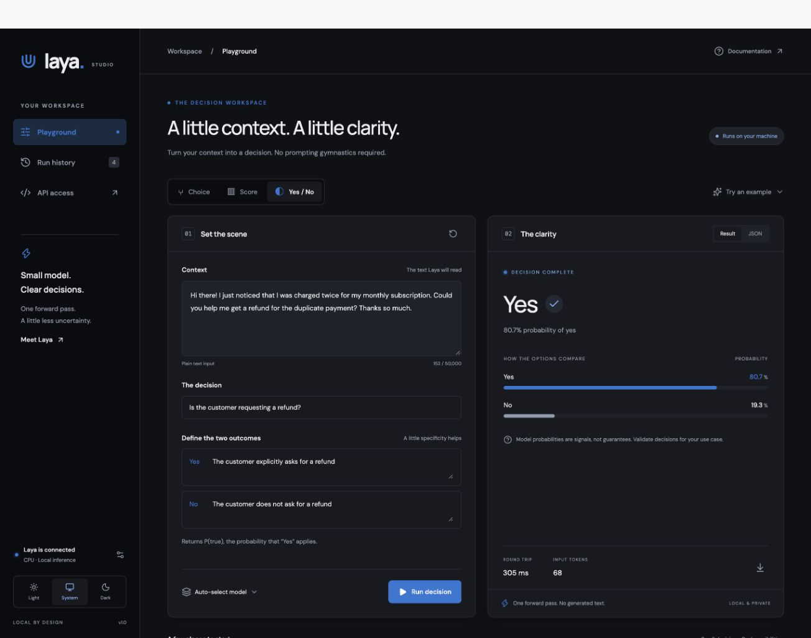

# Laya Studio

A friendly, local workspace for [Laya](https://github.com/NandhaKishorM/laya), the decision engine by Nandha Kishor and Convai Innovations. Give it some context, tell it what to decide, and explore the result: pick an option, score a situation, or check a yes/no statement.

Laya Studio brings the playground and Laya's Jev-compatible API together in one Docker Compose project. Use it in your browser, then connect the same engine to your own applications.

The interface uses the blue from Laya's logo with off-white and near-black themes. It follows your system appearance by default, with a sliding Light / System / Dark switch.

<picture>
  <source media="(prefers-color-scheme: dark)" srcset="docs/studio-dark.jpg">
  <source media="(prefers-color-scheme: light)" srcset="docs/studio-light.jpg">
  
</picture>

_A real local inference in the playground. Available in [light](docs/studio-light.jpg) and [dark](docs/studio-dark.jpg) themes._

## Quick start with Docker (recommended)

You'll need Git and a running Docker installation with Compose, such as Docker Desktop on macOS. No local Python, Node, GPU, or model setup is required.

```sh
git clone https://github.com/ewrogers/laya-studio.git
cd laya-studio
cp .env.example .env   # only on first setup; preserve an existing .env
docker compose up --build -d
```

Open [localhost:3000](http://localhost:3000), choose an example, and click **Run decision**. That's it. If port 3000 is busy, set `LAYA_WEB_PORT=3010` in `.env` and run `docker compose up -d` again.

The first build installs CPU PyTorch. The first request for each checkpoint downloads its weights from Hugging Face; allow a few minutes and disk space for multiple models. Subsequent requests reuse the named `model-cache` volume. Internet access is needed for builds and initial model downloads, not for inference with cached weights. Fonts are bundled; the UI has no analytics or third-party font requests.

```sh
docker compose ps
docker compose logs -f api
docker compose stop      # retain containers and models
docker compose down      # remove containers; retain models
```

Use `docker compose up -d` to restart. Do not use `down -v` unless you intend to delete the downloaded model cache.

## What's included

- Editable context, decision instructions, answer options, score levels, and yes/no criteria.
- Auto routing or explicit English, multilingual, and typed-decisions checkpoints.
- Actual probabilities, score distributions, request timing, token usage, raw JSON, and JSON downloads.
- Three starter examples; last 30 successful runs saved in this browser, with restore, export, and deletion.
- Responsive layout; system/light/dark appearance; keyboard controls and reduced-motion support.
- Health status, optional bearer key entry, request cancellation, and actionable server errors.

History contains your submitted text and model responses. It stays in local browser storage. API keys stay only in tab memory and must be entered again after a reload. The UI treats probability as a model signal, not measured real-world accuracy. Laya is a decision model, not a generative chat assistant. The UI sends one editable question per run; the exposed API accepts multiple questions.

## Deployment and service access

One Compose project contains two containers:

```text
Browser ── localhost:3000 ── web (Nginx + static React UI)
                                  │ /api/* proxy
                                  ▼
Other services ─────────────── api:8000 (Laya /v1/systemone)
                                  ▲
Mac applications ───────── localhost:8000
```

Both services run on the Mac's native Docker architecture; there is no forced x86 emulation or CUDA dependency. The API uses the upstream Dockerfile pinned to commit `9d955671415fc19f069b9cc998928075c1f255ec` (Laya 0.3.21) with CPU PyTorch 2.14.0. Models load lazily, up to two resident checkpoints by default. `/health` reports server availability and resident models; a healthy empty `loaded` list does not mean weights have been downloaded. Nginx allows up to ten minutes for a cold request.

| Caller                            | URL with default ports                                                                                                                                                                                           |
| --------------------------------- | ---------------------------------------------------------------------------------------------------------------------------------------------------------------------------------------------------------------- |
| UI                                | `/api/v1/systemone` on the UI's origin                                                                                                                                                                           |
| Application on your Mac           | `http://localhost:8000/v1/systemone`                                                                                                                                                                             |
| Container in this Compose project | `http://api:8000/v1/systemone`                                                                                                                                                                                   |
| Container in another project      | Join the external `laya-studio_default` network, then use `http://api:8000/v1/systemone`; alternatively use `http://host.docker.internal:8000/v1/systemone` where the runtime supports reaching host-bound ports |

The API also exposes `GET /health` and [interactive API documentation](http://localhost:8000/docs). Copy a request body from the UI's **API access** page. Send JSON with `Content-Type: application/json`. An existing Jev client can use `http://localhost:8000` as its base URL.

Default port bindings are loopback-only. To serve your LAN, set `LAYA_BIND_ADDRESS=0.0.0.0` and a strong `LAYA_API_KEY` in `.env`, then recreate the services. Enter the same key in the UI's connection settings. External clients send `Authorization: Bearer <key>`. The static UI and health endpoint remain public; inference requires the configured key. Use a TLS reverse proxy before exposing this beyond a trusted local network. Don't publish `.env`.

| Setting             | Default     | Purpose                                                                                          |
| ------------------- | ----------- | ------------------------------------------------------------------------------------------------ |
| `LAYA_WEB_PORT`     | `3000`      | Browser UI port                                                                                  |
| `LAYA_API_PORT`     | `8000`      | Direct HTTP API port                                                                             |
| `LAYA_BIND_ADDRESS` | `127.0.0.1` | Host interface for both published ports                                                          |
| `LAYA_THREADS`      | `4`         | CPU inference threads; keep at or below physical cores available to Docker                       |
| `LAYA_MAX_LOADED`   | `2`         | Resident checkpoint limit; use 1 to reduce memory, 3 to avoid eviction when switching all models |
| `LAYA_API_KEY`      | empty       | Optional inference bearer authentication                                                         |

## Run locally without Docker

Prefer to run both processes yourself? You'll need **Node.js 24**, **Git**, and [uv](https://docs.astral.sh/uv/) to create a Python 3.11 environment. Clone the project as above, then install the backend:

```sh
uv venv --python 3.11 .venv
uv pip install --python .venv/bin/python 'laya[serve] @ git+https://github.com/NandhaKishorM/laya.git@9d955671415fc19f069b9cc998928075c1f255ec' 'torch==2.14.0'
LAYA_DEVICE=cpu LAYA_HOST=127.0.0.1 LAYA_PORT=8000 LAYA_PRELOAD=0 .venv/bin/laya-serve
```

Leave that terminal running. In another terminal, start the UI:

```sh
npm ci
npm run dev
```

Open [localhost:5173](http://localhost:5173). The dev server forwards API requests to your local backend. On an Apple Silicon Mac, you can use `LAYA_DEVICE=mps` instead of `cpu` to request Metal acceleration. Models use your normal Hugging Face cache when running natively, separate from Docker's named volume.

These shell examples use macOS/Linux syntax. Native processes do not read the Compose `.env` file automatically: pass backend settings in their environment. If the API is on a different port, start Vite with `LAYA_BACKEND_URL=http://127.0.0.1:YOUR_PORT npm run dev`.

### Metal backend with a Docker UI

Docker's Linux VM on macOS cannot access Apple Metal/MPS. The fully containerized default therefore uses CPU. Upstream Laya supports **PyTorch MPS** natively on macOS; this is separate from the community MLX runtime and doesn't require MLX. See upstream's [Apple Silicon guidance](https://github.com/NandhaKishorM/laya/blob/9d955671415fc19f069b9cc998928075c1f255ec/docs/docker-platforms.md#apple-silicon).

For a native MPS backend with the same containerized UI, first stop the CPU stack to release its ports:

```sh
docker compose down
uv venv --python 3.11 .venv
uv pip install --python .venv/bin/python 'laya[serve] @ git+https://github.com/NandhaKishorM/laya.git@9d955671415fc19f069b9cc998928075c1f255ec' 'torch==2.14.0'
LAYA_DEVICE=mps LAYA_HOST=0.0.0.0 LAYA_PORT=8000 LAYA_PRELOAD=0 .venv/bin/laya-serve
```

In a second terminal:

```sh
docker compose -f compose.metal.yaml up --build -d
```

This is a standalone alternative Compose file, not an override to combine with `compose.yaml`. Its UI proxies to `host.docker.internal`. The native process must accept connections from Docker, hence `LAYA_HOST=0.0.0.0`; set `LAYA_API_KEY` on the native process if you need authentication. Native Laya does not automatically read this project's `.env`. If you change `LAYA_API_PORT`, use the same port for `LAYA_PORT` on the native process. Stop this alternative with `docker compose -f compose.metal.yaml down` before returning to the CPU stack.

Laya may fall back to CPU for unsupported operations or hardware; inspect `/health` after inference to see the actual device. The CPU Docker deployment has been exercised on this Mac. The optional native MPS configuration is documented but not benchmarked here.

## Development and verification

Node 24 and Python 3 are sufficient for UI development and the smoke test. Inference runs in Docker:

```sh
npm ci
docker compose up -d api
npm run dev
```

Vite listens on port 5173 and proxies `/api` to `http://127.0.0.1:8000`. Override with `LAYA_BACKEND_URL` when starting Vite. Production uses the Nginx runtime environment variable of the same name, so changing the backend does not require rebuilding the frontend.

```sh
npm run build
npm test
npx playwright install chromium
npm run test:e2e
python3 tests/smoke.py --web http://localhost:3000
```

Unit tests cover all Jev payload types, validation, authentication headers, and HTTP failures. Browser tests use explicit fixture responses to test editing, results, history, appearance, and mobile layout without downloading models. The separate smoke test uses **real inference** through both the direct API and web proxy and covers all three primitives. Adjust its `--web` and `--api` arguments for custom ports; provide `LAYA_API_KEY` in the environment when enabled. Browser history and API keys are not included in test fixtures.

Please keep changes focused, format with `npm run format`, and run the checks relevant to your change. Project conventions live in [AGENTS.md](AGENTS.md).

A ready-to-use GitHub Actions configuration is included at [deploy/ci.example.yaml](deploy/ci.example.yaml). To enable it, copy it to `.github/workflows/ci.yaml` and push using credentials with workflow permission. It checks formatting, the production build, unit/browser tests, and Compose configuration without downloading models.

## Troubleshooting

- **Port already in use:** change the corresponding port in `.env`; don't stop unrelated applications.
- **Backend offline:** inspect `docker compose ps` and `docker compose logs api`. Ensure Docker is running and has enough memory for your selected checkpoints.
- **First request is slow:** a model may still be downloading. Watch the API logs. Cancelling stops the browser request, but cannot interrupt a PyTorch forward pass already executing on the server.
- **Inference failed:** inspect API logs for the actual model/download/memory error. Try a single resident checkpoint with `LAYA_MAX_LOADED=1` if memory is constrained.
- **Cache permission denied after migrating an old volume:** the upstream image runs as UID 10001 and uses `/home/laya/.cache/huggingface`. Repair only this app's cache with `docker compose run --rm --no-deps --user root api chown -R 10001:10001 /home/laya/.cache/huggingface`.
- **Unexpected model decision:** choose the typed-decisions example/model, provide specific criteria, and evaluate on your own data. A high model probability is not a correctness guarantee.

## Built on Laya

All model inference comes from [NandhaKishorM/laya](https://github.com/NandhaKishorM/laya), an Apache-2.0 project. Check out its [documentation](https://nandhakishorm.github.io/laya/) for model capabilities, calibration, and deeper integration ideas.

Laya Studio is an independent companion. It is not an official Laya product and does not redistribute model weights in this repository.
